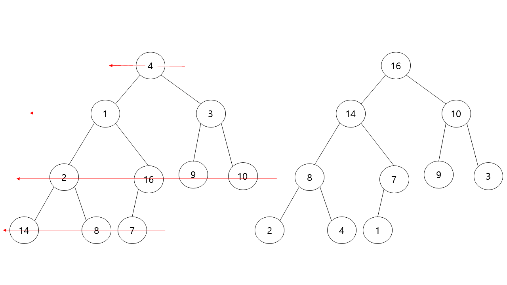
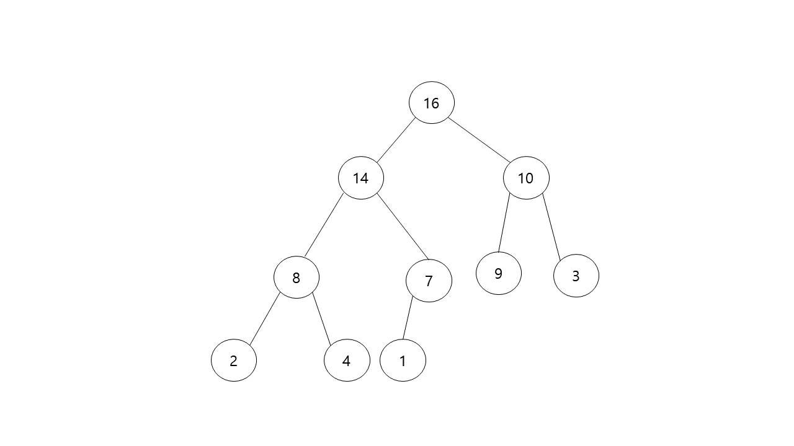
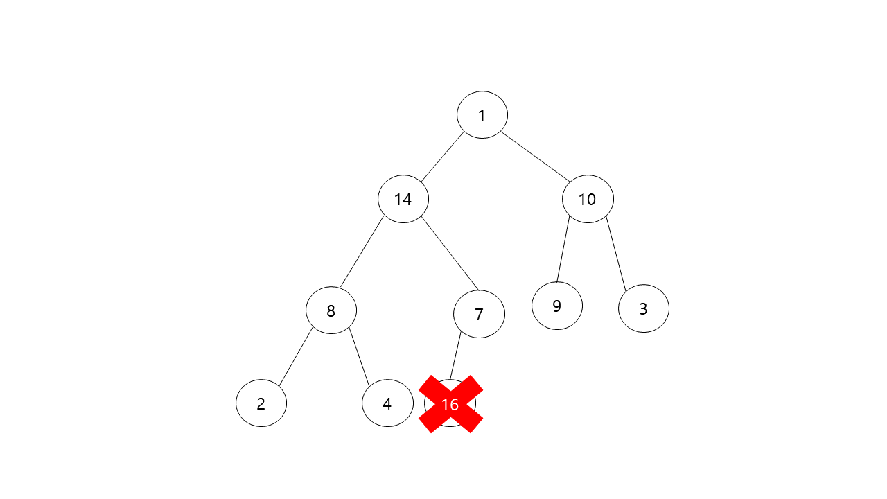
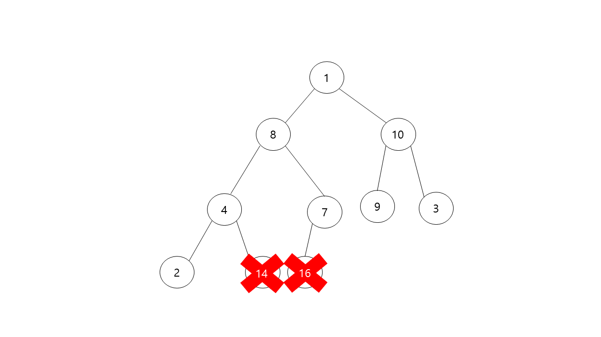
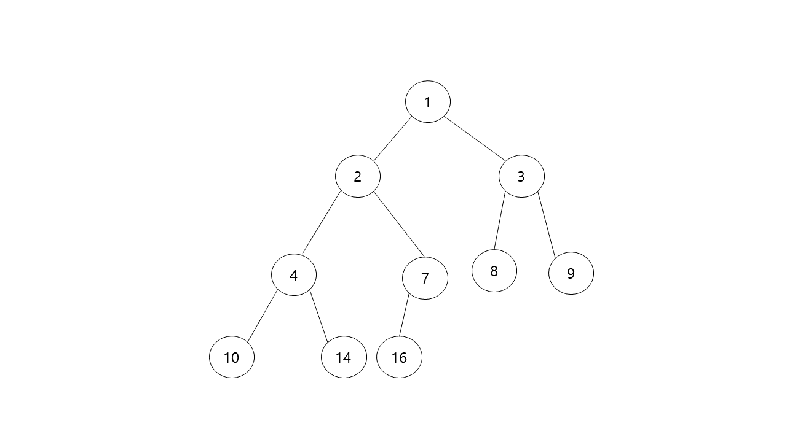

# Heap Sort

> **Max Heap Build**



초기의 배열은 정렬뿐만 아니라 heap property 조건또한 만족하지 못합니다. 

따라서 Heap Sort를 하기전에 Heap property를 만족하기 위하여 heapify 연산을 수행해야 합니다. 

제일 마지막 노드부터 루트 노드까지 각각의 노드에 대하여 heapify 연산을 통해 전체 tree를 heap으로 만듭니다.

해당 과정은 앞선 Heap 구조에 대한 글을 보셨으면 이해하기 쉬울것이라 생각하며 자세한 설명은 생략하겠습니다.


> **Heap Sort**

Max Heap에서 중요한 성질중 하나는 루트노드의 값이 제일 큰값을 가진다는 사실입니다. 

Heap sort는 해당 성질을 이용하여 정렬하는 정렬 알고리즘입니다. 아래의 첫번째 그림에서 루트노드의 값 16이 제일 큰값이기 때문에 해당노드를 제일 마지막노드인 1과 교환합니다. 16을 가지는 노드의 입장에서는 원래의 자리(제일 큰값이기 때문에 배열 인덱스상 제일 마지막 위치)로 배치된 격이기 때문에 해당 노드는 정렬이 완료된것으로 간주하여 정렬과정에서 제외시킵니다. 이후에 tree의 상태는 루트노드의 값이 바뀌었기 때문에 heap property를 만족하지 못할수도 있습니다. 따라서 루트노드에 대해 heapify 연산을 진행합니다. 이러한 과정을 반복적으로 진행하여 정렬된 값을 얻을수 있습니다. 

과정을 정리하자면 아래와 같습니다.

1. 루트노드와 마지막 노드를 교환합니다.
2. 새롭게 바뀐 마지막노드를 정렬과정에서 제외시킵니다.
3. 새롭게 바뀐 루트노드에 대하여 heapify 연산을 수행합니다.
4. 1번부터 3번까지 정렬이 끝날때까지 반복합니다.


* Max heap property를 만족하는 tree



* 16과 1 교환 (16은 정렬이 완료되어짐)



* 루트노드의 1에 대하여 heapify 연산 수행


* 14와 1 교환 (14는 정렬이 완료되어짐)



* Heap Sort 결과



> **Heap Sort 시간복잡도**

Heap Sort의 시간복잡도는 heapify의 연산 수행횟수에 비례하게 됩니다.

전체 노드의 갯수가 N이라면 heapify는 총 N(사실은 N-1번)번 수행하기 때문에 시간복잡도 ***O(NlogN)***이 됩니다.


> **Heap Sort Java code**

```java
void heapSort(int[] array, int size) {
        for (int i = size / 2; i >= 1; i--)
            maxHeapify(array, i, size);

        int treeSize = size;
        while (treeSize!=1) {
            swap(array, 1, treeSize);
            treeSize--;
            maxHeapify(array, 1, treeSize);
        }
    }

    void maxHeapify(int[] array, int parentIndex, int size) {
        if(isThereNoChild(parentIndex, size))
            return;

        int biggestChildIndex = getBiggestChildIndex(array, parentIndex, size);

        if(isMaxHeap(array,parentIndex,biggestChildIndex))
            return;

        swap(array, parentIndex, biggestChildIndex);
        maxHeapify(array, biggestChildIndex, size);
    }

    private boolean isMaxHeap(int[] array, int parentIndex, int biggestChildIndex) {
        return array[parentIndex] >= array[biggestChildIndex];
    }

    private void swap(int[] array, int parentIndex, int biggestChildIndex) {
        int temp = array[parentIndex];
        array[parentIndex] = array[biggestChildIndex];
        array[biggestChildIndex] = temp;
    }

    private int getBiggestChildIndex(int[] array, int parentIndex, int size) {
        if (parentIndex * 2 + 1 <= size)
            return array[parentIndex * 2] > array[parentIndex * 2 + 1] ? parentIndex * 2 : parentIndex * 2 + 1;

        return parentIndex * 2;
    }

    private boolean isThereNoChild(int index, int size) {
        return index * 2 > size;
    }
```


