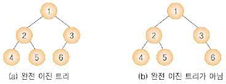
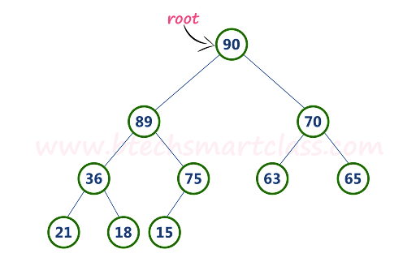
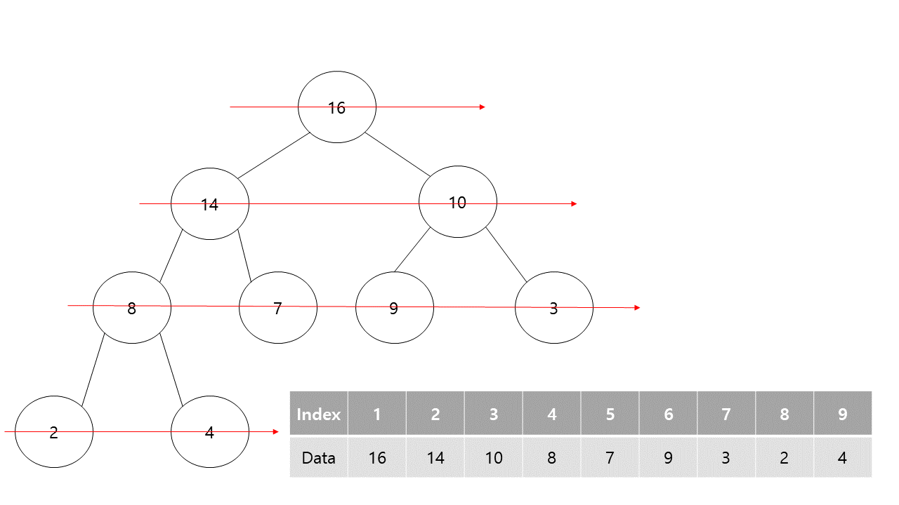
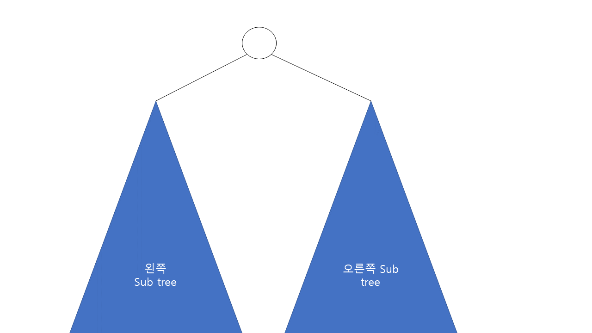
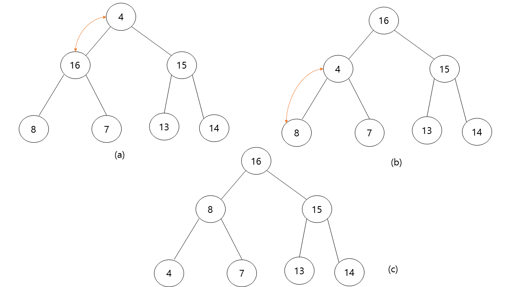

# Heap

> **Heap 정의**

다음 두가지를 만족할때 **Heap** 이라고 합니다.

* Complete binary tree
* Heap property

---

> **Complete binary tree**



그림 (a)와 그림 (b)의 공통점으로 각각의 노드들은 자식을 최대 2개까지 가질수 있다는 점입니다. 이러한 트리를 ***이진 트리(Binary tree)***라고 부릅니다.

이제 그림 (a)와 그림 (b) 각각을 살펴보겠습니다.

그림 (a)를 보면 트리의 같은 높이를 기준으로 왼쪽에서 오른쪽으로 노드들이 빽빽하게 채워져있는것을 알수 있습니다.

그림 (b)를 보면 제일 밑의 노드들을 보았을때 왼쪽부터 오른쪽으로 순서대로 노드들이 채워져 있지 않고 중간에 빠져있는것을 볼 수 있습니다.

그림 (a)와 같은 형태의 tree일때 ***완전 이진 트리(Complete binary tree)***라고 합니다.


> **Heap property**

Heap propery의 형태는 다음 두가지가 있습니다.

* Max heap property
* Min heap property

Min heap property는 Max heap property의 정반대이므로 해당 글에서는 Max heap property로만 설명을 진행하도록 하겠습니다.



Max heap property란 부모 노드의 값이 자식노드들의 값보다 크거나 같을 경우를 뜻합니다. 

그림에서 보는것과 같이 루트 노드의 값은 왼쪽 자식 노드의 값(89)과 오른쪽 자식 노드의 값(70) 보다 큰것을 확인할수 있습니다.

루트 노드외의 다른 모든 부모노드들을 확인하더라도 자식노드들의 값보다 크거나 같은 값을 가지는것을 확인할수 있습니다. 

이러한 형태를 가지는 tree를 ***Max heap property***를 만족한다라고 말할수 있습니다.

---

> **Complete binary tree와 일차원 배열**



완전 이진 트리는 위의 그림과 같이 일차원 배열로 표현할수 있습니다. 

하지만 완전 이진 트리를 일차원 배열로 표현하게 되면 한가지 문제점이 발생할수 있습니다. 언뜻보기에 트리상의 부모노드와 자식노드와의 관계가 유실되는것 처럼 보입니다. 그러나 그림을 잘 보시면 부모노드와 자식노드 index의 규칙성을 발견할수 있습니다.

부모노드의 index가 **i**라면 왼쪽 자식노드의 index는 **2*i**, 오른쪽 자식노드의 index는 **2*i+1**이 된다는 사실을 어렵지 않게 알수 있습니다. 또한 반대로 자식노드 index를 나누기 2한 결과가 부모노드의 index가 된다는 사실도 알수 있습니다. (여기서 오른쪽 자식노드의 index는 나누기 2한 결과에 소수점을 버립니다.)

> **MAX-HEAPIFY**




MAX-HEAPIFY란 왼쪽 Sub tree와 오른쪽 Sub tree 각각이 max heap property를 만족할때 부모 노드를 포함한 tree를 max heap으로 만드는 연산입니다. 





MAX-HEAPIFY의 과정은 위의 그림과 같습니다. 그림 (a)에서 루트노드를 제외한 즉, 루트노드의 왼쪽 sub 트리와 오른쪽 sub 트리는 모두 max heap을 만족합니다. 따라서 루트노드를 포함한 tree를 max heap를 만족하기 위해서 루트 노드에서 부터 max heapify를 시작합니다. 자식노드의 값중에 제일 큰 값과 부모노드(여기선 루트노드 입니다.)의 값을 비교하여 부모노드보다 값이 큰 자식노드가 있다면 해당 자식노드와 부모노드를 교환합니다. 그림 (a)에서는 16을 가지는 노드와 교환하게 되는데 이때 15를 가지는 자식 노드의 입장에서는 자신보다 값이 더 큰 노드가 부모노드가 되므로 자신을 루트로 하는 tree는 여전히 max heap property를 만족하게 됩니다. 그다음 그림 (a)와 같이 그림 (b)에서도 마찬가지로 4와 8의 노드가 교환이 되고 최종적으로 그림 (c)의 전체 tree는 max heap property를 만족하게 되며 MAX-HEAPIFY 연산은 종료됩니다.

> **MAX-HEAPIFY 시간 복잡도**

MAX-HEAPIFY의 시간복잡도는 결국 tree의 높이에 비례하게 된다는 사실을 쉽게 알수 있습니다. 따라서 tree의 높이를 h라고 했을때 시간복잡도는 O(h)가 됩니다. 높이 h일때 노드의 최대 갯수 N은 2^h-1가 되고 h=logN이 되므로 O(logN)의 시간복잡도를 가지게 됩니다.


> **MAX-HEAPIFY Java code**

``` java
void maxHeapify(int[] array, int parentIndex, int size) {
        if(isThereNoChild(parentIndex, size))
            return;

        int biggestChildIndex = getBiggestChildIndex(array, parentIndex, size);

        if(isMaxHeap(array,parentIndex,biggestChildIndex))
            return;

        swap(array, parentIndex, biggestChildIndex);
        maxHeapify(array, biggestChildIndex, size);
    }

    private boolean isMaxHeap(int[] array, int parentIndex, int biggestChildIndex) {
        return array[parentIndex] >= array[biggestChildIndex];
    }

    private void swap(int[] array, int parentIndex, int biggestChildIndex) {
        int temp = array[parentIndex];
        array[parentIndex] = array[biggestChildIndex];
        array[biggestChildIndex] = temp;
    }

    private int getBiggestChildIndex(int[] array, int parentIndex, int size) {
        if (parentIndex * 2 + 1 <= size)
            return array[parentIndex * 2] > array[parentIndex * 2 + 1] ? parentIndex * 2 : parentIndex * 2 + 1;

        return parentIndex * 2;
    }

    private boolean isThereNoChild(int index, int size) {
        return index * 2 > size;
    }
```


