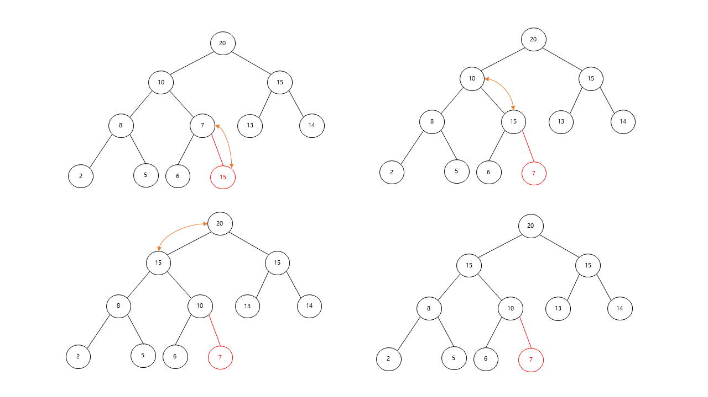
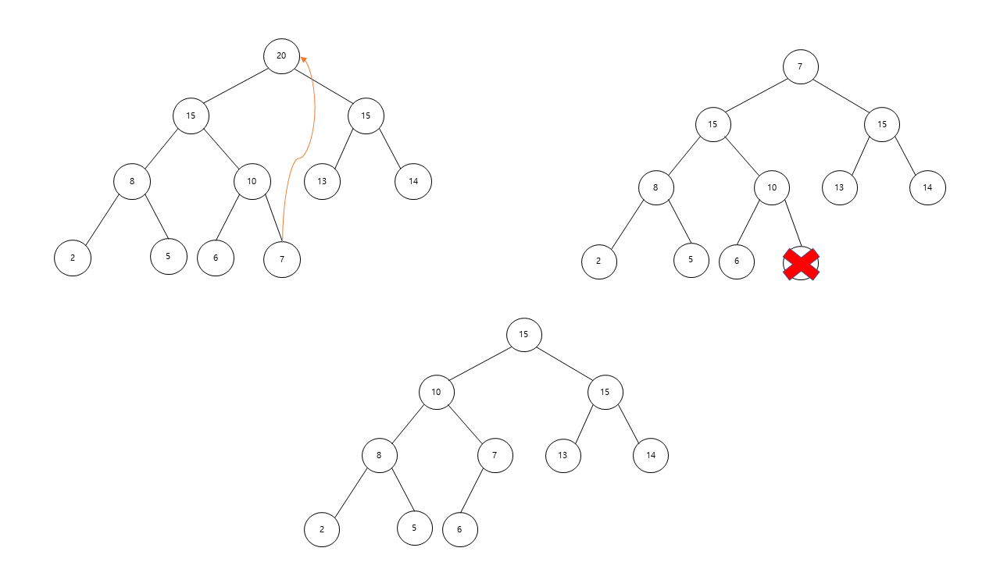

# Priority Queue

> **Maximum Priority Queue**

최대 우선순위 큐 (Maximum Priority Queue)는 다음의 두 가지 연산을 지원하는 자료구조입니다.

* insert(x): 새로운 원소 x를 삽입
* extractMax(): 최대값을 삭제하고 반환

최대 우선순위 큐는 Max heap을 이용하여 구현하기 때문에 heap 자료구조와 굉장히 밀접한 관계에 있습니다.

따라서 우선 순위 큐 자료구조를 이해하기 위해서는 heap 자료구조에 대한 이해가 선행되어야 합니다.


> **insert(x)**



새로운 값 15를 최대 우선순위 큐에 저장하는 연산 insert(15)의 과정은 위의 그림을 통해 쉽게 이해할수 있습니다.

먼저 마지막 위치에 새로운 값 15를 추가합니다. 새롭게 추가된 노드와 부모노드 사이를 제외하고는 heap property를 만족하기 때문에 두 노드를 비교하여 새롭게 추가된 노드가 부모노드 보다 크다면 서로 교환합니다. 위의 그림에서는 새롭게 추가된 노드(15)가 부모노드(7)보다 크므로 교환하게 됩니다. 그 다음 다시 15와 그 부모노드인 10을 제외하고는 모두 heap property를 만족하므로 15와 10(부모노드)을 비교하여 똑같이 교환과정이 이루어집니다.

과정을 정리하면 아래와 같습니다.

1. 새롭게 추가하는 노드를 tree의 마지막 위치에 insert 합니다.
2. 새롭게 추가된 노드와 그의 부모노드를 비교하여 부모노드보다 값이 크다면 교환합니다.
3. 새롭게 추가된 노드가 부모노드보다 작거나 같거나 루트까지 다다르면 과정을 종료합니다.


> **insert(x) 시간복잡도**

최대 리프노드로부터 루트노드로까지 비교연산과 교환과정이 이루어지므로 시간복잡도는 tree의 높이 h에 비례하여 **O(h)**가 됩니다. 높이 h만큼의 full binary tree의 총 노드갯수 n은 2^h-1 = n 이므로 ***O(logN)***이 됩니다.


> **extractMax()**



extractMax()는 최대값을 뽑아내는 연산으로 루트노드의 값을 취하게 됩니다. 위의 그림에서는 최대값이 20이 되겠습니다. 그 다음 마지막 노드 7을 새롭게 루트노드로 대체하게 되는데 이때 tree를 보았을때 루트노드의 왼쪽 sub tree와 오른쪽 sub tree는 heap property를 만족하지만 루트노드에 대해서는 만족하지 못하기 때문에 heap 자료구조를 유지하기 위해서는 루트노드에 대해서 heapify 연산을 수행해야 합니다. 

과정을 정리하면 아래와 같습니다.

1. 최대값인 루트노드의 값을 추출하고 마지막노드를 새롭게 루트노드로 대체시킵니다.
2. 루트노드에 대하여 heapify 연산을 수행합니다.


> **extractMax() 시간복잡도**

루트노드 추출 하는데 필요한 시간 O(1), 마지막 노드를 새롭게 루트노드로 대체시키는데 필요한 시간 O(1) 마지막으로 루트노드에 대하여 heapify하는데 필요한 시간 O(logN)이므로 전체 시간복잡도는 ***O(logN)***이 됩니다.


> **insert(x)와 extractMax() Java code**

```java
import java.util.Arrays;

public class MaxPriorityQueue {

    private int[] datas = new int[100];
    private int size = 0;

    public MaxPriorityQueue() {
    }

    public MaxPriorityQueue(int[] initialDatas) {
        this.datas = initialDatas;
        size = initialDatas.length - 1;
    }

    public void insert(int data) {
        size++;
        datas[size] = data;
        int i = size;
        while (!isRootNode(i) && datas[getParentIndex(i)] < datas[i]) {
            swap(getParentIndex(i), i);
            i = getParentIndex(i);
        }
    }

    public int extractMax() {
        int maxValue = datas[1];
        swap(1, size);
        size--;
        maxHeapify(1);

        return maxValue;
    }

    private void maxHeapify(int index) {
        if (isThereNoChild(index))
            return;

        if (isMaxHeap(index))
            return;

        int biggestChildIndex = getBiggestChildIndex(index);
        swap(index, biggestChildIndex);
        maxHeapify(biggestChildIndex);
    }

    private int getParentIndex(int i) {
        return i / 2;
    }

    private boolean isRootNode(int i) {
        return i == 1;
    }

    private void swap(int aIndex, int bIndex) {
        int temp = datas[aIndex];
        datas[aIndex] = datas[bIndex];
        datas[bIndex] = temp;
    }

    private boolean isMaxHeap(int parentIndex) {
        return datas[parentIndex] >= datas[getBiggestChildIndex(parentIndex)];
    }

    private int getBiggestChildIndex(int parentIndex) {
        if (parentIndex * 2 + 1 <= size)
            return datas[parentIndex * 2] > datas[parentIndex * 2 + 1] ? parentIndex * 2 : parentIndex * 2 + 1;

        return parentIndex * 2;
    }

    private boolean isThereNoChild(int index) {
        return index * 2 > size;
    }
}

```


