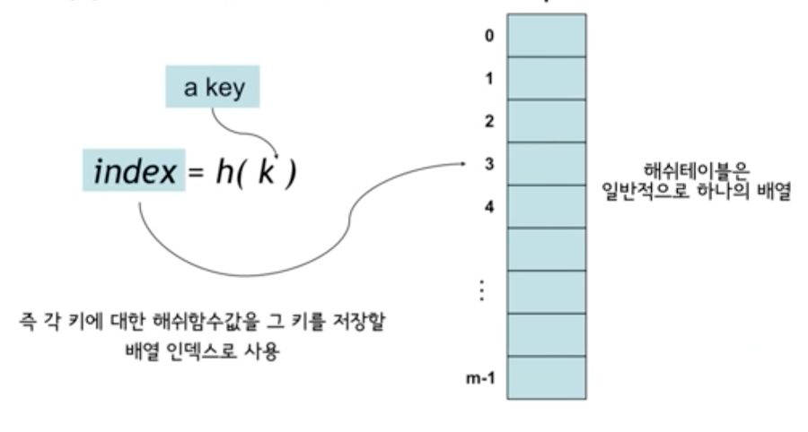

# Hashing

> **Hashing Function**

Hashing Function이란 저장하고자하는 데이터인 key 값을 해쉬테이블(일차원배열)에 저장할 배열 인덱스로 만들어주는 함수입니다.

> **Hash 연산**

Hash 자료구조는 일반적인 자료구조와 마찬가지로 다음 세가지 연산을 제공합니다

* search
* insert
* delete

각각의 시간복잡도는 해쉬 함수에 필요한 약간의 시간이 필요로 하게 되고 결국 시간복잡도는 ***O(1)***이 됩니다.

하지만 해당 시간복잡도는 적절한 가정하에서 나오는 시간복잡도이기 때문에 최악의 경우도 생각해 보아야 합니다. 결론적으로 말하자면 최악의 경우에 발생할수 있는 시간복잡도는 ***O(n)***의 시간복잡도 가지게 됩니다.

> **Hash Collision**

서로 다른 두 key에 대하여 해쉬 함수를 적용하다보면 동일한 결과값이 나올수도 있습니다. 

이러한 경우를 해쉬 충돌(Hash Collision)이라고 합니다. 위의 그림에서는 서로 다른 두 key k2, k5의 해쉬 함수를 적용한 결과값 h(k2), h(k5)이 같은 값이 나오게 되어 일차원 배열상에 동일한 위치에 저장되려고 하고 있습니다.

Hash 자료구조는 이러한 충돌 현상을 피할수 없으므로 해결할 방법이 필요하게 됩니다. 해결 방법은 대표적으로 다음 두가지의 방법이 있습니다.

* Chaining
* Open addressing

> **Chaining**

충돌이 발생할수밖에 없는 원인은 일차원 배열상에 특정 인덱스에 저장할수 있는 데이터는 오직 한가지여야 한다는 점입니다. 이러한 점을 해결하기 위해서 각각의 인덱스에 데이터 자체를 저장하는게 아닌 연결리스트를 저장하여 서로 충돌되는 데이터를 연결하여 해결할수 있습니다. 이러한 방법을 ***Chaining***이라고 합니다.

Chaining을 사용한 Hash 자료구조의 시간복잡도는 최악의 경우에 ***O(n)***이 된다는 것을 조금만 생각해보면 쉽게 알수가 있습니다. 만약에 저장하려는 모든 데이터의 해쉬 함수 결과값이 동일하다면 하나의 연결리스트에 모든 데이터가 연결되기 때문에 결국 Hash 자료구조가 아닌 연결리스트 자료구조를 쓰는것과 동일하게 됩니다. 따라서 시간복잡도는 ***O(n)***이 됩니다.

> **Open addressing**

오픈 어드레싱(Open addressing)은 충돌 해결의 또 다른 방법입니다. 오픈 어드레싱은 다음과 같이 대표적으로 세가지 방법이 있습니다.

* Linear Probing
* Quardratic Probing
* Double Hashing

본 글에서는 Linear Probing과 Quardratic Probing에서만 다루겠습니다.

> **Linear Probing**

그림에서 표현되어지는 A5, A9, B9, C2의 숫자는 해쉬 함수 결과 위치할 인덱스를 나타냅니다.

그림 (a)에서는 A5, A2, A3 모두 충돌되지 않고 저장되는걸 알수 있습니다. 그림 (b)에서는 저장하려는 B5가 이미 저장되어 위치한 A5와 충돌되어지는데 이때 바로 아래에 위치한 인덱스를 확인하여 비어있으면 B5는 해당 위치에 저장되게 됩니다. 만약 비어있지 않으면 계속해서 한칸씩 내려가며 비어있는 자리에 저장합니다. A9는 충돌되지 않고 그대로 저장되고 B2는 A2와 충돌되어져 한칸씩 내려가며 비어있는 자리인 4번째 위치에 저장되게 됩니다.

Linear Probing의 큰 단점으로는 **클러스터링**의 문제점이 있습니다. 클러스터링이란 테이블의 키들이 연속으로 뭉쳐있는 현상을 말하는데 클러스터가 크면 클수록 새로운 키가 삽입될때 해싱의 결과가 클러스터 끝으로 해싱될 확률이 높아져 클러스터의 크기가 점점 더 커지게 됩니다. 즉 악순환의 반복이 일어나게 됩니다. 이러한 클러스터 현상을 해소하기 위한 방법으로 Quardratic Probing이 있습니다.

> **Quardratic Probing**

Linear Probing의 경우에 충돌이 발생했을때 한칸씩 아래로 내려가면서 빈자리에 저장하는 방법이라면 Quardratic Probing은 해쉬 함수에 특정 수식을 추가로 적용하는 방법입니다. 예를 들어 특정 수식을 추가한 함수의 형태가 **h(k), h(k)+1, h(k)+2^2, h(k)+3^2**라면 충돌이 발생했을때 해당 수식의 순서대로 +1만큼 내려가 충돌 여부를 확인하고 충돌이라면 2^2만큼 내려가고 다시 3^2만큼 내려가 확인하는 방식으로 진행됩니다. 이러한 방식을 적용하게 되면 클러스터링 문제를 어느정도 해소할수 있게 됩니다.

