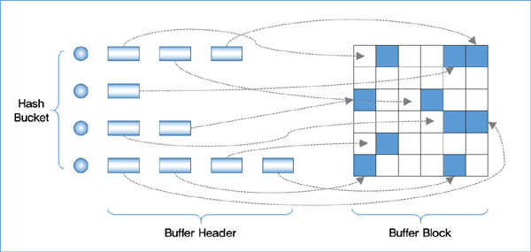

# DATABASE INDEX (1)

> **INDEX**

Index를 이용하면 대용량의 테이블에서 원하는 데이터를 빠르게 가져올 수 있습니다. 특정 테이블의 컬럼 기준으로 index를 생성할수 있고 선택된 컬럼으로 정렬된 채로 테이블에 저장되어 관리됩니다. index 테이블의 구성은 테이블 컬럼의 데이터와 해당 데이터의 위치값(ROWID)이 저장됩니다. 이러한 특성 때문에 빠르게 원하는 데이터를 가져올수 있게 됩니다.

>**ROWID**

인덱스에 저장된 ROWID는 실제 데이터가 물리적으로 어디에 저장되었는지 나타냅니다. ROWID의 구성은 아래와 같습니다.

* 데이터 파일 번호
* 해당 데이터 파일에 있는 블록 번호
* 블록안에서의 레코드 번호

3가지의 정보를 통해 실제 데이터를 얻을수 있게 됩니다.

> **B Tree**

인덱스의 대표적인 구조로 B Tree가 있습니다. b tree는 루트 블록, 브랜치 블록, 리프 블록으로 이루어져 있습니다. 실제 테이블 데이터가 위치하는 ROWID는 리프블록이 가지고 있고 루트 블록은 브랜치 블록을 가리키고 브랜치 블록은 아래 위치의 브랜치 블록을 가리키거나 리프 블록을 가리키게 됩니다. 위의 그림을 보며 좀 더 자세히 살펴보겠습니다. 루트 블록에 **(서)**라고 저장된 레코드는 루트 블록의 (서) 보다 크거나 **같은** 레코드를 담고 있는 브랜치 블록을 가리키게 됩니다. 그리고 최상단의 LMC 레코드는 아래 아래의 레코드 (서)를 기준으로 (서)보다 작거나 **같은** 레코드를 담고 있는 브랜치 블록을 가리키게 됩니다. 브랜치 블록도 루트 블록과 동일하게 다른 블록(브랜치 블록, 리프 블록)을 가리키게 됩니다. 여기서 강덕승이라는 데이터를 찾을때 b tree의 탐색은 어떻게 이루어질까요? 

> **수직적 탐색**

강덕승이라는 데이터를 찾기 위해서는 먼저 b tree에서 해당 레코드가 처음 발견되는 **시작점**을 찾는 과정이 이루어집니다. 이러한 과정을 **수직적 탐색**이라고 합니다. 위의 그림을 보며 수직적 탐색 과정을 천천히 살펴 보겠습니다. 먼저 루트 블록에서 강덕승은 (서)보다 작거나 같으므로 LMC 레코드가 가리키는 블록으로 이동합니다. 다음 블록에서는 2번째 레코드가 강덕승이므로 해당 레코드가 가리키는 블록을 갈것처럼 보이나 LMC 블록이 강덕승 보다 작거나 같은 블록을 가리키므로 LMC 블록이 가리키는 리프블록으로 이동해야 합니다. 리프블록으로 이동한 결과 강덕승이라는 레코드의 시작점을 찾게 되고 수직적 탐색은 종료되어 집니다.

> **수평적 탐색**

위에서 수직적 탐색으로 강덕승 레코드의 시작점을 찾게 되었습니다. 이후에 조건에 만족하는 (강덕승) 레코드들을 모두 찾기 위하여 이중 연결리스트로 이어진 리프 블록들을 탐색하게 됩니다. 이러한 과정을 **수평적 탐색**이라고 합니다. 시작점으로 부터 강덕승이라는 레코드를 만족할때까지 리프 블록을 읽게 됩니다. 그러다 강민주라는 레코드를 발견하게 되고 수평적 탐색은 종료되어 집니다.

> **버퍼 캐시**

아무리 index를 사용하더라도 매번 원하는 데이터를 디스크에서 얻기 위해 I/O 작업을 하는것은 굉장히 많은 시간이 소요되어집니다. 따라서 디스크에서 읽은 블록을 DB의 버퍼 캐시(메모리)에 저장하여 다음번에 동일한 데이터 블록을 읽을때 I/O 작업을 생략하여 메모리에서 빠르게 읽어올수 있게 됩니다. buffer cache를 읽어 오는 과정을 다음과 같습니다.

* Index의 결과값으로 ROWID를 얻습니다.
* ROWID를 분해하여 DBA(데이터 파일 번호 + 블록 번호)를 얻어 해쉬함수의 input으로 사용합니다.
* 해쉬함수의 output 값으로 버퍼캐시에 존재하는 원하는 데이터 블록의 위치를 얻게 됩니다.

