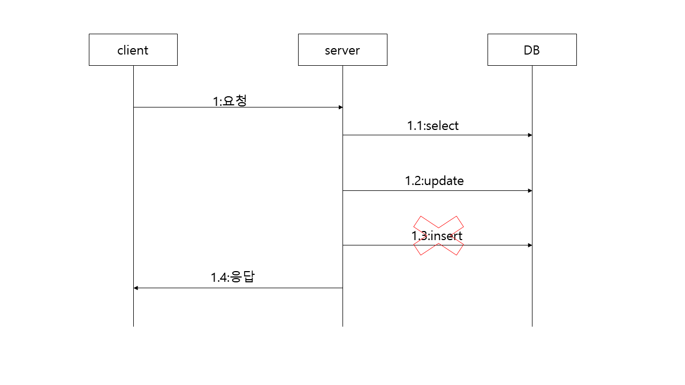

# 트랜잭션

> **트랜잭션 정의**

여러 읽기/쓰기를 논리적으로 하나로 묶는것을 트랜잭션이라고 합니다. 그렇기 때문에 쿼리가 모두 반영(커밋) 되거나 모두 반영하지 않는(롤백) 성질을 가지고 있습니다. 개발자는 이러한 트랜잭션의 롤백 기능이 없다면 개발에 많은 어려움이 발생합니다. 만약 트랜잭션이 없다면 위의 그림에서 1.3의 insert 쿼리를 db에 날릴경우에 실패하였다면 1.2 update 쿼리를 개발자는 어떻게든 원상복귀 시켜야 하는 로직을 따로 만들어야 합니다. 하지만 트랜잭션의 롤백 덕분에 자동으로 1.2 update 쿼리는 취소되어집니다.

> **ACID**

트랜잭션에는 다음과 같이 4가지의 특성이 있습니다.

* 원자성 (Atomicity)
  * 트랜잭션의 작업이 일부만 실행되지 않고 모든것이 성공하거나 모두가 실패하는것입니다 (All or Nothing)
* 일관성 (Consistency)
  * 트랜잭션이 성공되면 DB의 상태는 일관적으로 유지 되는것을 말합니다.
* 격리성 (Isolation)
  * A라는 트랜잭션이 수행될때 B라는 다른 트랜잭션이 A의 작업에 끼어들지 못하도록 보장하는것을 말합니다.
  * 즉, A의 트랜잭션은 B의 트랜잭션 작업으로 인한 변경사항에 영향을 받지 않습니다.
* 지속성 (Durability)
  * commit된 트랜잭션은 DB에 영구적으로 반영 되는것을 말합니다.

> **트랜잭션의 범위**

트랜잭션의 범위는 db 커넥션의 기준으로 나누어집니다. 예를 들어 하나의 메소드가 다른 메소드를 호출하였을때 호출된 메소드 또한 같은 트랜잭션으로 묶이기 위해서는 **동일한 커넥션**을 사용해야 동일한 트랜잭션으로 묶일수가 있습니다. 

> **스프링 프레임워크의 @Transactional**

위에서 말했듯이 서로 다른 메소드를 동일한 트랜잭션으로 묶기 위해서는 모든 메소드가 동일한 커넥션을 사용해야 하기 때문에 Connection 객체를 계속해서 전달해야 합니다. 이렇게 계속해서 파라미터로 Connection 객체를 받는것은 상당히 번거로운 작업이기 때문에 이러한 작업을 스프링 프레임워크는 @Transactional 어노테이션으로 지원하고 있습니다. @Transactional 어노테이션은 쓰레드마다 특정한 저장소를 만들고 거기에 connection을 저장하여 필요한 메소드에서 가져다 사용할수 있게 지원합니다. 따라서 모든 메소드마다 connection 객체를 파라미터로 일일이 선언할 필요가 없습니다.

 

> **트랜잭션 격리수준**

트랜잭션의 격리수준은 트랜잭션의 특성인 **Isolation**을 지원합니다. 트랜잭션의 격리수준으로 다음과 같습니다.

* Read Uncommited
* Read Commited
* Repeatable Read
* Serializable

Read Uncommited 격리수준은 거의 사용되지 않기 때문에 해당 글에서는 다른 3가지의 격리수준만 다루겠습니다.

> **Read Commited**

Read Commited는 커밋된 데이터만 읽고 커밋된 데이터만 덮어쓰기 할수 있는 격리수준입니다. 커밋된 데이터만 읽기 위하여 커밋된 값과 트랜잭션 진행중인 값을 따로 보관하여 커밋된 값만 읽도록 하고 커밋된 데이터만 덮어쓰기위해서는 같은 데이터를 수정한 트랜잭션이 있다면 끝날때까지 대기했다가 해당 쿼리를 실행하게 됩니다. 그렇다면 Read Commited를 지원하지 못했을때 어떤 문제점이 생길까요?

위의 그림을 살펴보겠습니다. 위의 사용자를 A라고 하고 아래의 사용자를 B라고 하겠습니다. A의 사용자가 stock 테이블의 값을 +1하여 2로 변경하였습니다. 바로 그 뒤에 B 사용자가 stock 테이블을 select 하고 결과값으로 2를 얻습니다. 그리고 stockcnt 테이블도 조회를 하였는데 결과값으로 1을 얻었습니다. 그런데 사실 B의 사용자가 원하는 stockcnt 테이블 값은 2이지만 A의 사용자가 stockcnt 테이블값을 2로 변경하기 전에 해당 테이블을 읽었기 때문에 발생하는 문제입니다. 즉, A의 사용자의 트랜잭션을 커밋하기 전에 읽었기 때문에 발생하게 된것입니다. 또한 A의 트랜잭션이 commit 되어지지 않고 roll back 되어진다면 어떤일이 일어날까요? 그렇게 되면 B 사용자는 roll back 되어진 데이터 (잘못된 데이터)를 읽게 되므로 이 또한 문제가 발생하게 됩니다. 이러한 문제를 dirty read라고 합니다.

또 다른 문제로 dirty wirte라는 문제가 있습니다. dirty write 또한 commit 되지 않은 데이터를 읽어서 발생하는 문제로 자세한 내용은 위의 그림을 통해서 어렵지 않게 이해할수 있습니다.

> **Repeatable Read**

Repeatable Read는 트랜잭션 동안 동일한 데이터를 반복적으로 읽었을때 같은 결과값을 읽도록 지원합니다. 반복적으로 읽기 가능하기 위해서 데이터를 버전마다 관리하고 읽는 시점에 해당 버전에 해당하는 데이터만 읽습니다. 트랜잭션이라는게 다른 트랜잭션의 변경사항에 영향을 받지 않도록 하는 단위이기 때문에 이러한 격리수준은 중요하게 됩니다. 만약 동일한 데이터에 대한 쿼리에 변경된 사항을 얻고 싶다면 트랜잭션을 나누어야겠지요? Repeatable Read를 지원하지 않았을때는 문제점은 어떤게 있을까요? 위의 그림에서는 A 사용자가 points 테이블에서 id가 A인 데이터 10을 얻었습니다. 바로 뒤에 B 사용자가 해당 데이터를 1증가 시켰고 id가 B인 데이터를 1 감소 시키고 commit 하였습니다. 그리고 A 사용자가 id가 B인 데이터를 조회하였는데 그 결과 9라는 데이터를 얻었습니다. 여기서 문제점은 id가 A인 데이터가 10이었을때 id가 B인 데이터 또한 10인 상태였지만 B 사용자가 commit 한 이후에 조회했을때는 9라는 데이터가 조회되었다는 사실입니다. 따라서 A 사용자의 트랜잭션은 B 사용자의 트랜잭션에 영향을 받게 되었으므로 트랜잭션 isolation이 지켜지지 않았다는 점입니다.

> **Serializable**

Repeatable Read은 phantom read 현상은 막아주지 못합니다. phantom read란 동일한 쿼리 결과값에 이전에는 없었던 값이 추가되는 현상입니다. Serializable 격리수준은 이러한 현상까지도 해결할수 있습니다.

---

출처: https://www.youtube.com/watch?v=poyjLx-LOEU

